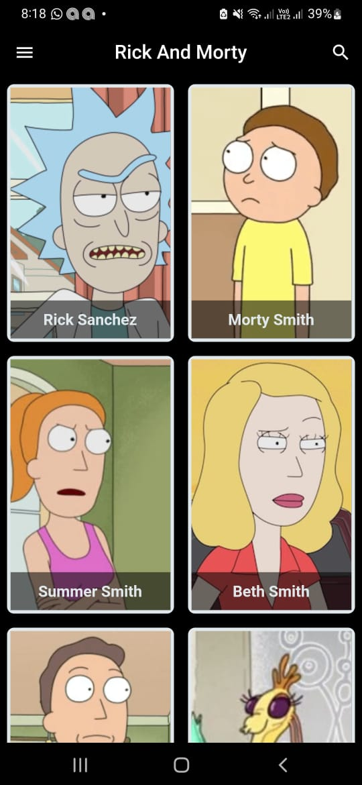
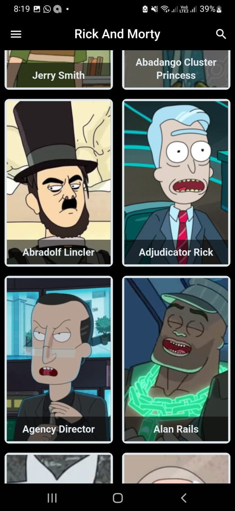
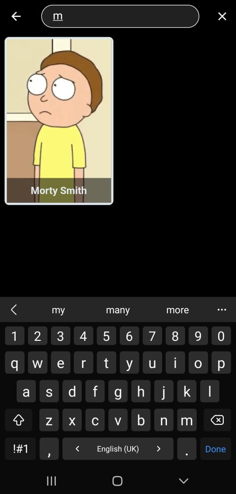

# Rick and Morty Character App

## Description

The Rick and Morty Character App is a Flutter application that displays all characters from the popular TV show "Rick and Morty". Users can view detailed information about each character. The app is built using the MVVM (Model-View-ViewModel) architecture and utilizes the BLoC (Business Logic Component) pattern for state management.

## Features

- Display a list of all characters from the Rick and Morty series.
- View detailed information about each character, including name, status, species, and more.
- Search for characters by name.
- Responsive design suitable for both mobile and tablet screens.

## Screenshots

  
  
   

## Architecture

The app follows the MVVM architecture pattern:

- **Model:** Represents the data layer. This includes data classes and data sources.
- **View:** Represents the UI layer. This includes Flutter widgets that display data to the user.
- **ViewModel:** Acts as a mediator between the View and the Model. It retrieves data from the Model and provides it to the View. It also handles user interactions and business logic.

## State Management

The app uses the BLoC pattern for state management:

- **BLoC:** Manages the state of the application and handles business logic. It receives events, processes them, and outputs states.
- **Events:** User actions that are dispatched to the BLoC.
- **States:** The state of the application that is emitted by the BLoC in response to events.

## Contributing

Contributions are welcome! Please fork the repository and submit a pull request for any improvements or bug fixes.

## License

This project is licensed under the MIT License - see the [LICENSE](LICENSE) file for details.

## Contact

If you have any questions or suggestions, feel free to reach out.

- Email: [moazosama204@gmail.com](mailto:moazosama204@gmail.com)
- LinkedIn: [Muaz Osama](https://www.linkedin.com/in/moaz-osama-161ab723a/)

